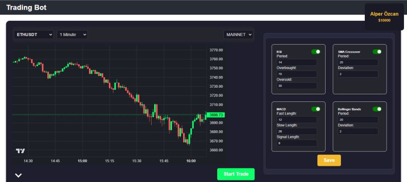

# Trading Bot

<p >
  
</p>

This project is an automated trading bot developed using Python and React. It enables users to execute trades more effectively by applying predefined trading strategies.

## Features
- **Automated Trading:** Executes buy/sell orders based on predefined strategies.
- **Flexible Strategy Integration:** Easily integrate and test various trading strategies.
- **Real-Time Data Analysis:** Analyzes market data to provide actionable insights.
- **User-Friendly Interface:** Built with React for an intuitive and seamless user experience.

## Technologies Used
- **Backend:** Python (for strategy implementation and data analysis)
- **Frontend:** React (for the user interface)
- **API Integration:** Real-time market data through integrated APIs

## Installation

### 1. Clone the repository:
   ```bash
   git clone https://github.com/freecnsz/trading-bot.git
   cd trading-bot
   ```

### 2. Install dependencies:
#### Backend (Python):
   ```bash
   pip install -r requirements.txt
   ```
  #### Frontend (React):
  ```bash
  cd frontend
  npm install
  ```

### 3. Run the Application:
#### Start the backend server:
 ```bash
  cd backend
  uvicorn app.main:app --reload
  ```
#### Start the frontend server:
 ```bash
  cd frontend
  npm start
  ```
## Usage

- Run the application and see it on your localhost through the React interface.
- Configure your trading strategy from frontend and click *save* button to save your strategy.
- Monitor your trades and view detailed analytics in real time.

## Contributing

Contributions are welcome! Feel free to open issues or submit pull requests to enhance the project.

## Developer

- [Özgür Cansız](https://github.com/freecnsz)
- [Muhammed Fatih Çınar](https://github.com/fatih045). 


## License

This project is licensed under the [MIT License.](LICENSE)
   
   
   
